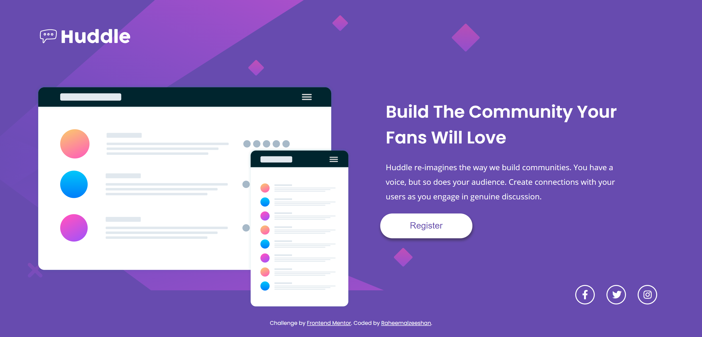

# Frontend Mentor - Huddle landing page with single introductory section

## Welcome! 👋

Thanks for checking out this front-end coding challenge.

[Frontend Mentor](https://www.frontendmentor.io) challenges help you improve your coding skills by building realistic projects.

**To do this challenge, you need a basic understanding of HTML and CSS.**
## Table of contents

- [Overview](#overview)
  - [The challenge](#the-challenge)
  - [Screenshot](#screenshot)
  - [Links](#links)
- [My process](#my-process)
  - [Built with](#built-with)
  - [What I learned](#what-i-learned)
  - [Continued development](#continued-development)
  - [Useful resources](#useful-resources)
- [Author](#author)

## Overview

### The challenge

### Screenshot

## My process

### Built with

- Semantic HTML5 markup
- CSS custom properties
- Flexbox
- Responsive Desing for all devices

### What I learned
This is my first landing page for frontendMentor. Here i have learn about adding fonts using cdn and learn upgrade my frontend desing skill.

### Useful resources

- Family: [Poppins] (https://fonts.google.com/specimen/Poppins) - Poppins font family i have used for heading 
- Family: [Open-Sans] (https://fonts.google.com/specimen/Open+Sans)- Open Sans font family used for paras and links.
- Social Media Icons [Font Awesome] (https://fontawesome.com/)- I have use Font Awesome icons version 5.8.2 you can get all Font Awesome cdn link form here 👉 https://cdnjs.com/libraries/font-awesome/

## Author

- Linkedin - [Mohammed Abdul Raheem](https://www.linkedin.com/in/raheemalzeeshan)
- Frontend Mentor - [@raheemalzeeshan](https://www.frontendmentor.io/profile/raheemalzeeshan)
- Twitter - [@raheemalzeeshan](https://www.twitter.com/raheemalzeeshan)

**Have fun building!** 🚀
